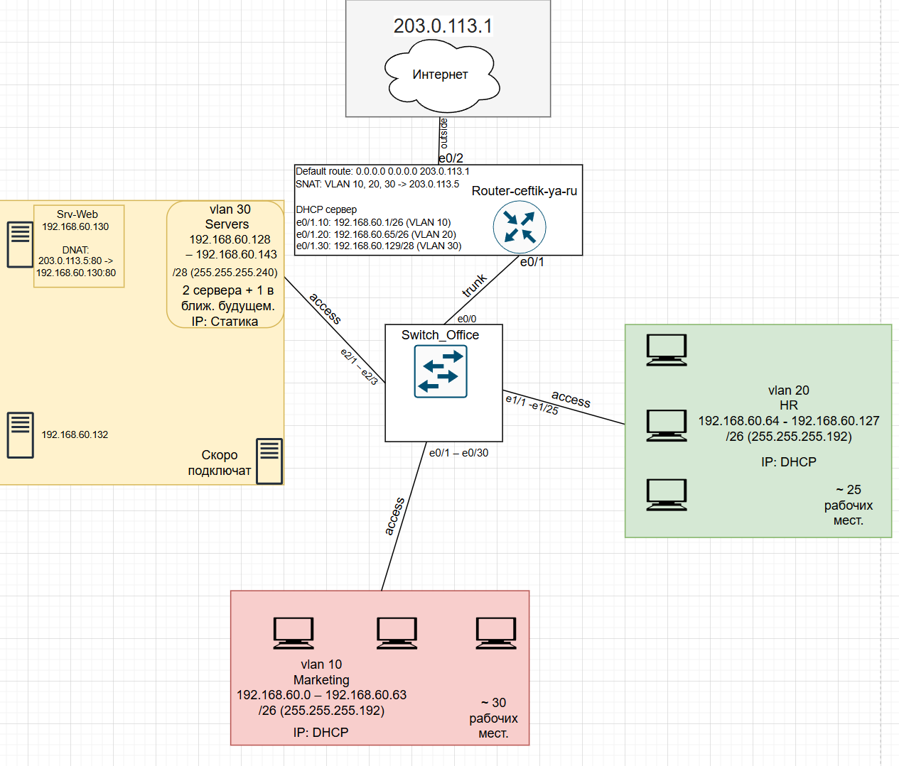
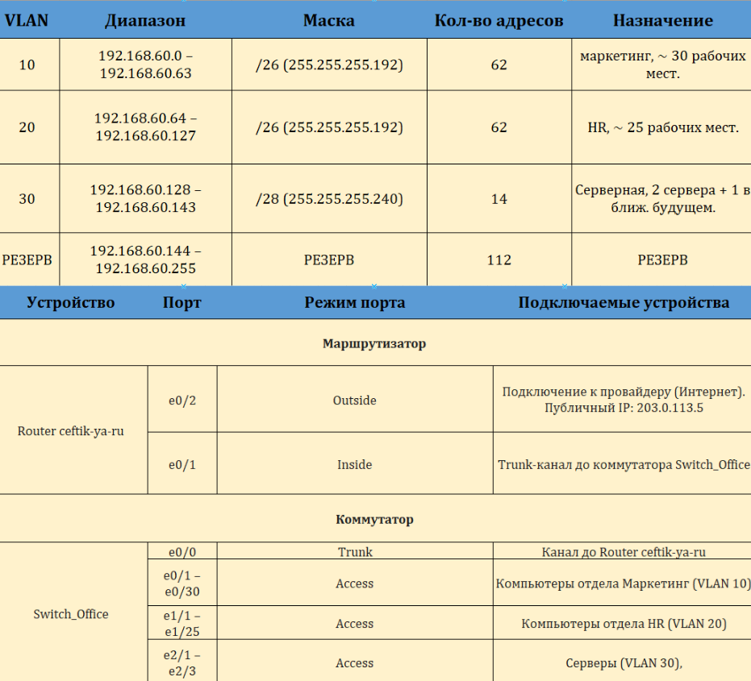
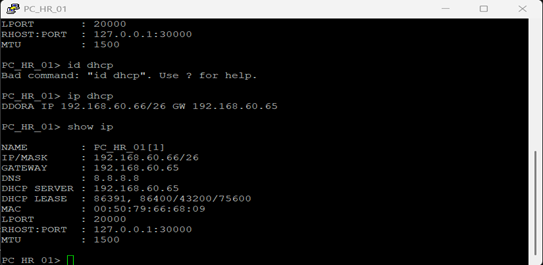
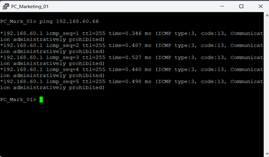
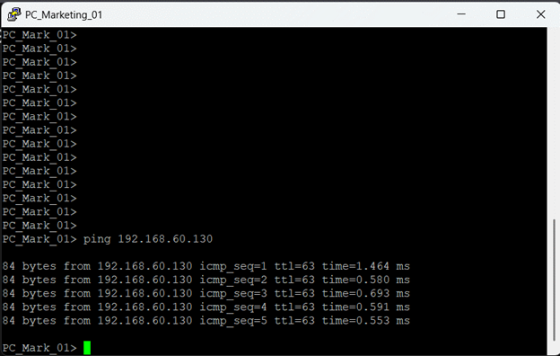
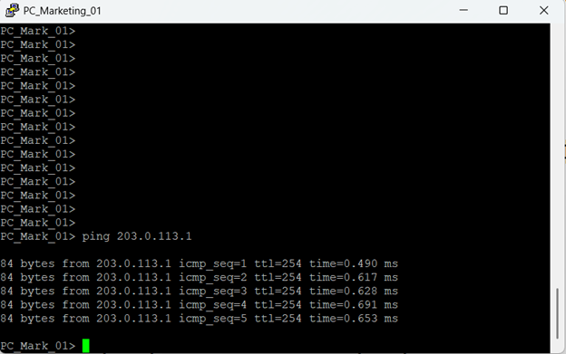
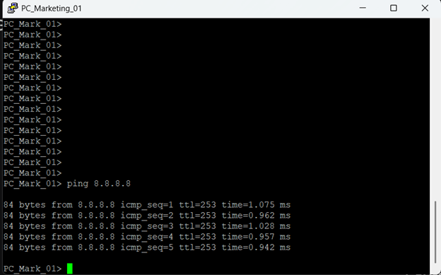
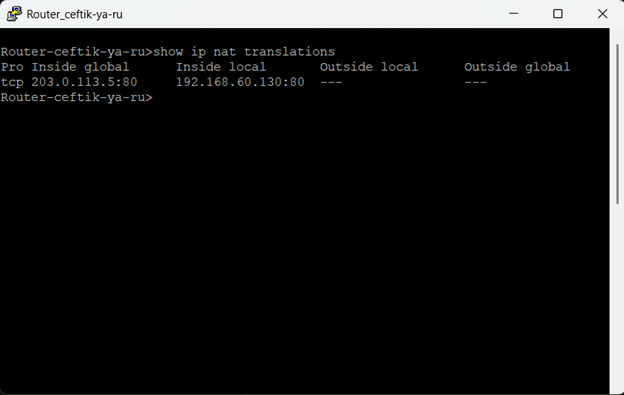

📌 **Описание проекта**
Реализация сетевой инфраструктуры для двух отделов (Маркетинг и HR) и серверной зоны. Проект выполнен в эмуляторе с упором на сегментацию трафика и безопасность внешних соединений.

## 🏗 Логическая топология и адресация
Сеть построена на базе адресного пространства `192.168.60.0/24`. Для оптимизации и безопасности использованы следующие подсети:

* **VLAN 10 (Маркетинг):** `192.168.60.0/26` (до 62 хостов)
* **VLAN 20 (HR):** `192.168.60.64/26` (до 62 хостов)
* **VLAN 30 (Серверная):** `192.168.60.128/28` (до 14 хостов, статические IP)

## 🛠 Техническая реализация
1. **DHCP и статика:** Маршрутизатор `Router-ceftik-ya-ru` настроен как DHCP-сервер для отделов. Серверы (VLAN 30) используют статические адреса (например, Web-сервер — `192.168.60.130`).
2. **NAT:** * **SNAT:** выход в интернет через публичный IP `203.0.113.5`.
   * **DNAT (Port Forwarding):** публикация веб-сервера (порт 80) во внешнюю сеть.
3. **Коммутация:** Настроены Trunk-каналы и Access-порты для разделения трафика.

### 📋 План коммутации и инструменты
* **Инструменты:** Cisco IOS, Draw.io, Wireshark.
* **Трафик:** Настроены Trunk-порты (e0/1 роутера, e0/0 коммутатора) и Access-порты для VLAN 10, 20 и 30.

## 🛡️ Верификация и тесты
Для проверки работоспособности проведены следующие тесты:

### 1. Получение IP
Проверка автоматической выдачи адресов в сегменте HR через процесс DORA.

---

### 2. Изоляция
Доступ из Маркетинга к HR ограничен на уровне маршрутизатора. Пинг блокируется.

---

### 3. Доступ к серверам
Пользователи имеют доступ к внутренним ресурсам в VLAN 30 (Серверная).

---

### 4. Внешняя связность
Успешный выход через шлюз провайдера и проверка работы SNAT (пинг 8.8.8.8).

---

### 5. Таблица NAT
Подтверждение корректного проброса портов (DNAT) для веб-сервера.

